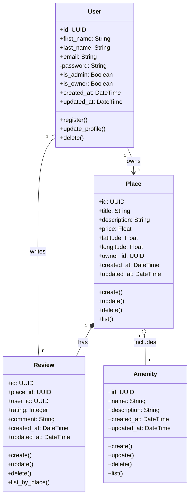

## Explanatory Notes
### User
Role: Represents a registered user in the HBnB system. A user can own properties (places) and write reviews for places they have visited.
Key Attributes: id (UUID), first_name, last_name, email, password (hashed), is_admin, is_owner, created_at, updated_at.
Key Methods: register(), update_profile(), delete().

### Place
Role: Represents a property or accommodation listed by a user (owner). It acts as the central hub for reviews and amenities.
Key Attributes: id (UUID), title, description, price, latitude, longitude, owner_id, created_at, updated_at.
Key Methods: create(), update(), delete(), list().

### Review
Role: Represents feedback left by a user for a specific place.
Key Attributes: id (UUID), place_id, user_id, rating (Integer), comment, created_at, updated_at.
Key Methods: create(), update(), delete(), list_by_place().

### Amenity
Role: Represents a specific feature or facility available in a place (e.g., Wi-Fi, Pool, Air Conditioning).
Key Attributes: id (UUID), name, description, created_at, updated_at.
Key Methods: create(), update(), delete(), list().

---

### Entity Relationships & Business Logic

### Layer Communication (Facade Pattern)
The layers communicate sequentially. The Presentation Layer interacts with the BusinessLogic Layer through a Facade Pattern to keep operations decoupled. The BusinessLogic then commands the Persistence Layer to save or fetch data.

### User & Place (One-to-Many Association)
A single user can own multiple places, establishing an "owns" relationship. The Place entity stores the owner_id to maintain this link.

### Place & Review (Composition)
A place contains multiple reviews in a strict "has" relationship (Composition). Reviews cannot exist without a place. If a place is deleted from the system, all associated reviews are automatically destroyed.

### User & Review (Dependency / Association)
A user writes reviews. The system tracks this relationship via the user_id inside the Review entity to identify the author, but the review's lifecycle is directly tied to the Place, not the User.

### Place & Amenity (Many-to-Many Aggregation)
A place can include multiple amenities, and the same amenity can be linked to multiple places (Aggregation). If a place is deleted, the amenities remain in the system's database to be used by other places.
