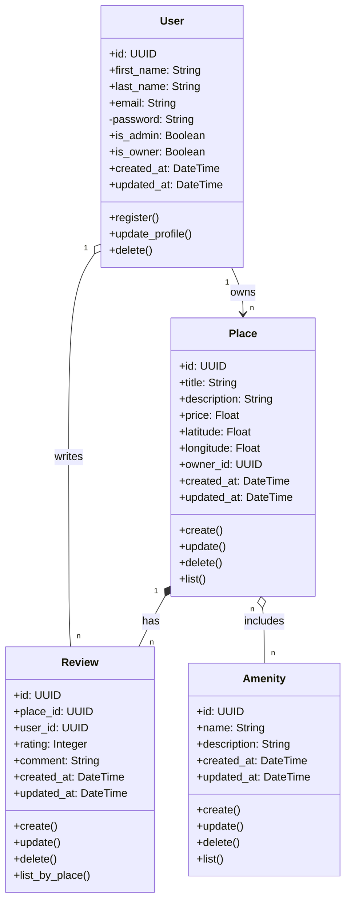

## Explanatory Notes
### User
Role: A person using the app. They can own places or write reviews.

Key Attributes: id, first name, last name, email, password, and if they are an admin or owner.

Key Methods: register(), update_profile(), delete().

### Place
Role: A house, room, or apartment listed on the app for rent.

Key Attributes: title, description, price, location (latitude/longitude), and the owner's ID.

Key Methods: create(), update(), delete(), list().

### Review
Role: A user's feedback (rating and comment) about a place.

Key Attributes: rating number, comment text, user_id (who wrote it), and place_id (which place).

Key Methods: create(), update(), delete(), list_by_place().

### Amenity
Role: Extra features a place has, like Wi-Fi, a pool, or parking.

Key Attributes: name, description.

Key Methods: create(), update(), delete(), list().

## Entity Relationships
### User & Place (One-to-Many)
One user can own many places. Each place belongs to only one user.

### Place & Review (Strong Connection)
A place has many reviews. If a place is deleted from the app, all its reviews are deleted automatically.

### User & Review
A user writes reviews for places. The system links the review to the user who wrote it.

### Place & Amenity (Many-to-Many)
A place can have many amenities (like Wi-Fi and Pool). At the same time, the same amenity (like Wi-Fi) can be added to many different places.
