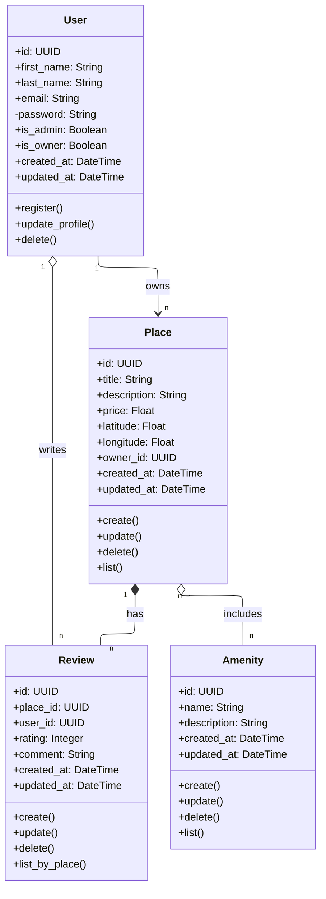
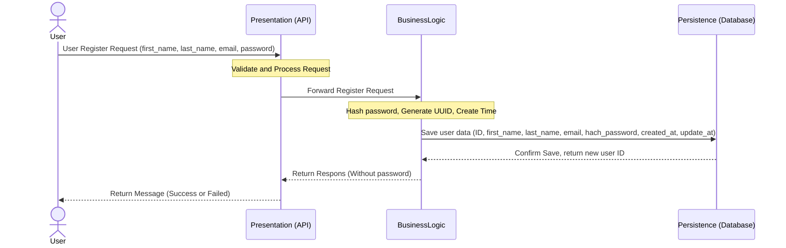
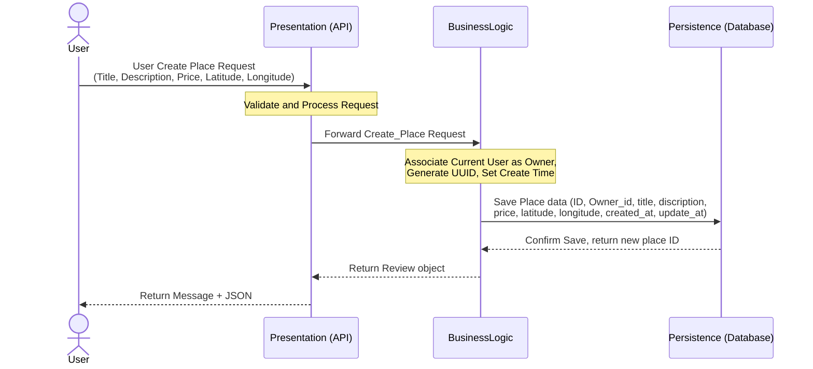
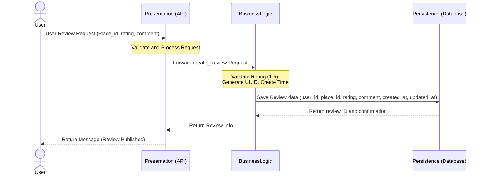
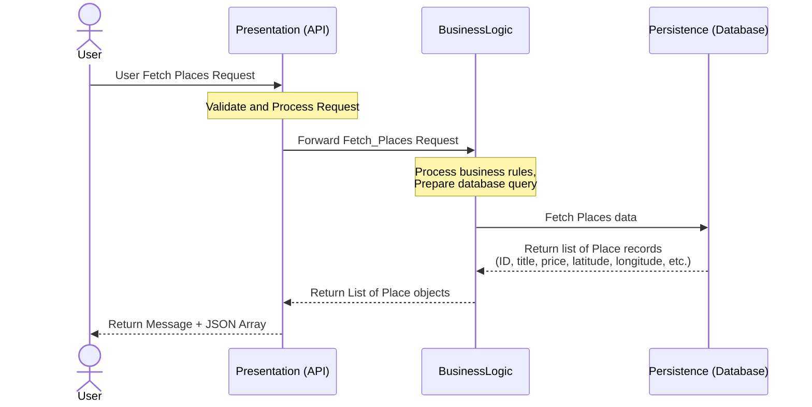

# HBnB Evolution – Project Documentation

---

## 📘 Introduction

**HBnB Evolution** is a simplified based on Airbnb application. 

This app allows users to:
* Create and manage accounts.
* List places for rent.
* Add amenities to places.
* Write reviews for places they visited.

This document serves as the main blueprint for the project and includes:
1. **Package Diagram:** The overall system architecture.
2. **Class Diagram:** The database entities and relationships.
3. **Sequence Diagrams:** The step-by-step flow for API requests.

---

## 🧱 High-Level Architecture – Package Diagram

### Architectural Layers:
1. **Presentation Layer:** Contains the `API` and `Services`. It acts as the entry point for the application, handling incoming client requests.
2. **BusinessLogic Layer:** Contains the core models (`User`, `Place`, `Review`, `Amenity`). It receives requests from the Presentation Layer via the **Facade Pattern**, processes business rules, and ensures data integrity.
3. **Persistence Layer:** Contains the `Database` and `Repository`. It handles data storage, retrieval, and database operations based on commands from the Business Logic Layer.

---

## 🏛️ Detailed Class Diagram

---

## 🔁 Sequence Diagrams – API Interaction Flow

## The following diagrams illustrate the step-by-step interactions between the layers (User -> API -> BusinessLogic -> Persistence) for four core operations.

### 1. User Registration

**Description**: User sends registration data → API → Service → Repository → Confirmation response.

---

### 2. Place Creation

**Description**: User submits place info → API → PlaceService → DB → response
---

### 3. Review Submission

**Description**: Validating and saving a user's review for a specific place, ensuring rating bounds (1-5) are respected.

---

### 4. Fetching a List of Places

***Description**: User asks for places → filters applied → DB queried → results returnded

---

## ✅ Final Notes

This document contains all the necessary to start building the HBnB project:
* **The Package Diagram:** Shows the big picture of the system.
* **The Class Diagram:** Shows the database models and their relationships.
* **The Sequence Diagrams:** Show how the system handles user requests step-by-step.

This file should be kept updated as the project grows and new features are added!
